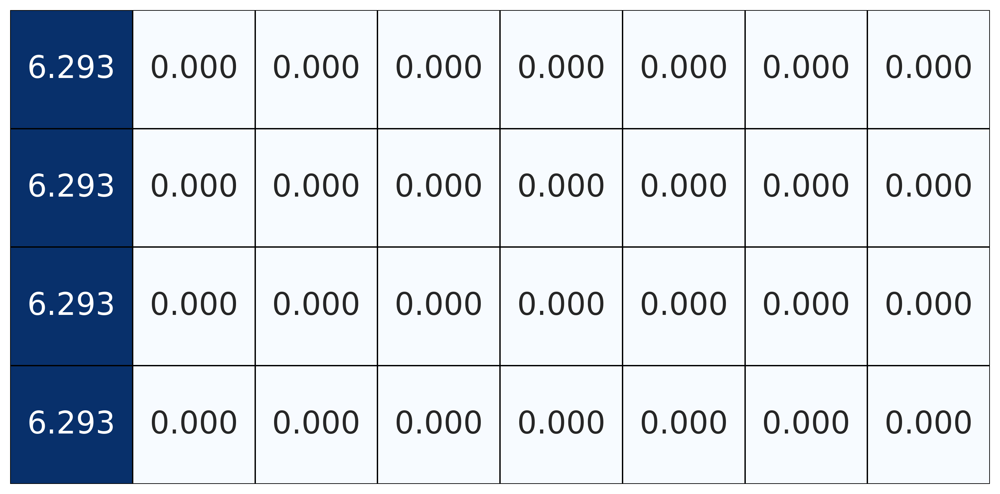
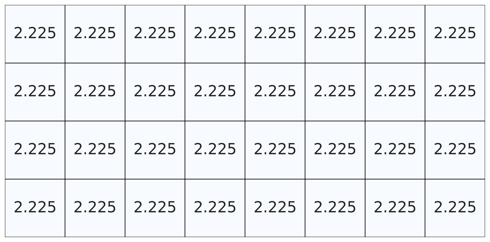

<table border="0" style="border-collapse: collapse; margin: auto; border: none;">
  <tr style="border: none;">
    <td style="padding: 10px; border: none;">
      
      
(a) Original matrix

    </td>
    <td style="padding: 10px; border: none;">
      
      
(b) After Hadamard transform

    </td>
    <td style="padding: 10px; border: none;">
      
      
(c) After Givens rotation

    </td>
  </tr>
</table>

 

  <b>Figure R2. The effect of progressive smoothing on the uniform matrix:</b> (a) original uniform matrix; (b) after Hadamard transform, all magnitudes are concentrated in a dominant channel; (c) following additional Givens rotation, the matrix is restored to its original uniform state.

