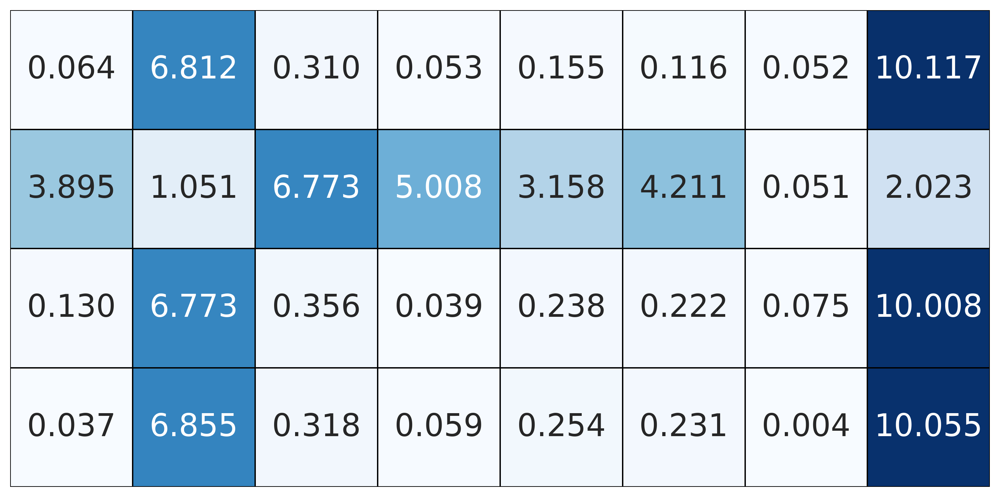
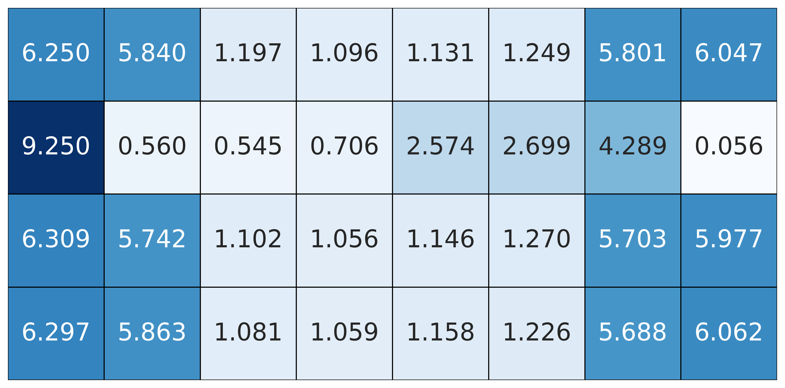
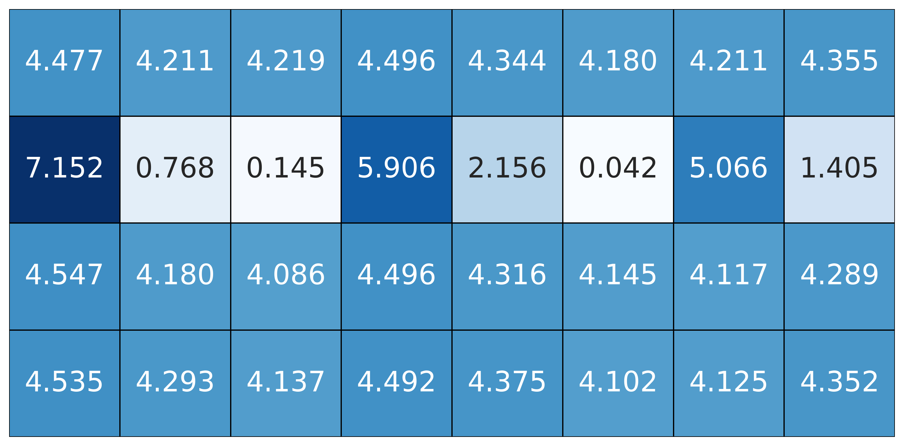

<table border="0" style="border-collapse: collapse; text-align: center; margin: auto;">
  <tr>
    <td style="padding: 10px; border: none;">
      
    </td>
    <td style="padding: 10px; border: none;">
      
    </td>
    <td style="padding: 10px; border: none;">
      
    </td>
  </tr>
  <tr style="font-size: 0.9em; font-weight: bold;">
    <td style="border: none;">(a) Original matrix</td>
    <td style="border: none;">(b) After Hadamard transform</td>
    <td style="border: none;">(c) After Givens rotation</td>
  </tr>
</table>

 

  <b>Figure R1. Progressive smoothing of outlier channels in calibration data via Hadamard transform and Givens rotation:</b> (a) original matrix with prominent outliers and explicit outlier tokens; (b) after Hadamard transform, extreme outliers channels are attenuated but the deviation of outlier tokens from the mainstream channel distribution are exacerbated.; (c) following additional Givens rotation, the distribution becomes more uniform, the distortion caused by Hadamard tranform is alleviated.

